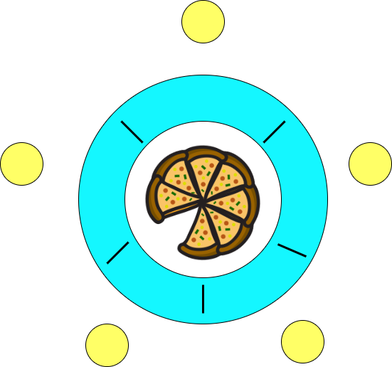
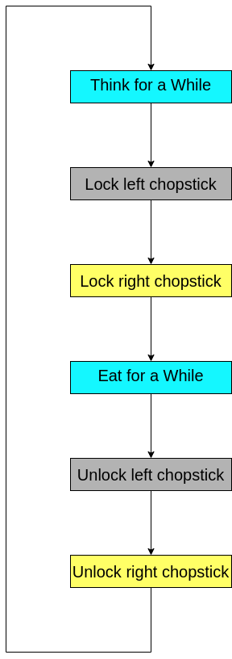
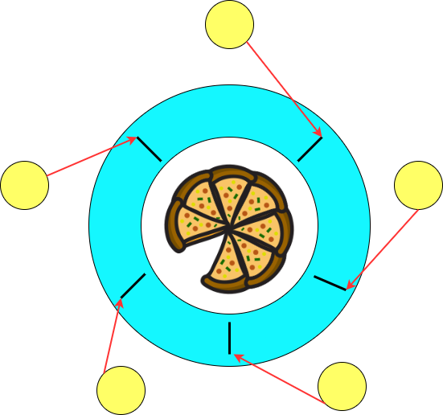

## **Introduction**

The **Bounded Buffer Problem** is a **classical synchronization problem** in operating systems that models the interaction between **producers** and **consumers** sharing a **fixed-size buffer**. 

This problem represents a **real-world scenario** where data is **produced** and **consumed concurrently**, requiring proper coordination to avoid issues like **data corruption**, **buffer overflow**, and **starvation**.

A **virtual lab simulation** of the bounded buffer problem helps students understand the challenges of **concurrent programming** and the importance of **synchronization mechanisms** in ensuring **data consistency** and **system stability**.

## Example of Bounded Buffer Problem in an Operating System to Illustrate the Problem

Let’s consider a scenario where two processes—a producer and a consumer—are sharing a common memory buffer without any synchronization mechanisms like semaphores or mutexes. This example highlights the problems that can arise due to the lack of proper coordination:

## **Scenario**

- A text editor (**producer**) writes characters into a shared buffer.
- A spell checker (**consumer**) reads characters from the buffer to check for spelling errors.
- The buffer size is fixed at **5 characters**.

## **Initial State**

- The buffer is **empty**.
- The **producer** starts generating characters and placing them into the buffer.
- The **consumer** starts reading and processing characters from the buffer.

## **Potential Unsafe Scenarios**

### 1. **Race Condition**

- If the producer and consumer try to access the buffer at the same time, they could corrupt the data.
- **Example:**  
  The producer writes `"HELLO"` into the buffer, but before it finishes, the consumer starts reading and only gets `"HE"` because the producer was interrupted halfway.

### 2. **Overwriting Data (Lost Update Problem)**

- If the producer is faster than the consumer, it could overwrite data before the consumer has a chance to process it.
- **Example:**
  - Producer writes `"HELLO"` → Consumer starts reading `"HE"`.
  - Producer writes `"WORLD"` before the consumer finishes → Consumer reads `"HEWOR"` (corrupted output).

### 3. **Buffer Overflow**

- If the producer keeps adding data when the buffer is full, it could result in a buffer overflow.
- **Example:**
  - Buffer size = 5 → Producer tries to write `"HELLO"` + `"WORLD"` → Causes overflow, and some data is lost.

### 4. **Reading from an Empty Buffer**

- If the consumer starts reading from the buffer while it's empty, it might receive garbage values or cause a crash.
- **Example:**
  - Consumer expects data → Buffer is empty → Consumer reads uninitialized values.

### 5. **Deadlock**

- If both the producer and consumer reach a state where they are waiting for each other to act, the system can enter a deadlock.
- **Example:**
  - Producer waits for space in the buffer to become available.
  - Consumer waits for data to be added to the buffer.
  - Neither can proceed, causing a permanent block.

## **Why We Need Semaphores or Mutexes**

- **Semaphores** help regulate how many slots are available for the producer and consumer, preventing overflow and underflow.
- **Mutexes** ensure that only one process accesses the buffer at a time, preventing race conditions and data corruption.
- Proper synchronization mechanisms prevent these issues and maintain the integrity and consistency of the data exchange.

## **Conclusion**

This example illustrates how the lack of synchronization causes unpredictable and inconsistent behavior, which is exactly why the **Bounded Buffer Problem** needs to be solved with **semaphores** and **mutexes**.

## **Analysis**

First, we notice that these philosophers are in a **thinking-picking up chopsticks-eating-putting down chopsticks** cycle as shown below.

The **"pick up chopsticks"** part is the key point. How does a philosopher pick up chopsticks? In a program, we simply print out messages such as **"Have left chopstick"**, which is very easy to do. The problem is each chopstick is shared by two philosophers and hence a **shared resource**. We certainly do not want a philosopher to pick up a chopstick that has already been picked up by his neighbor. This is a **race condition**.

To address this problem, we may consider each chopstick as a **shared item protected by a mutex lock**. Each philosopher, before he can eat, **locks his left chopstick** and **locks his right chopstick**. If the acquisitions of both locks are successful, this philosopher now owns two locks (hence two chopsticks) and can eat. After finishing eating, this philosopher **releases both chopsticks** and returns to thinking. This execution flow is shown below.

Because we need to **lock and unlock a chopstick**, each chopstick is associated with a **mutex lock**. Since we have **five philosophers** who think and eat simultaneously, we need to create **five threads**, one for each philosopher. Since each philosopher must have access to the two mutex locks that are associated with its left and right chopsticks, these **mutex locks are global variables**.

## **Discussion**

**Key Considerations in Resource Allocation and Deadlock Prevention**

### **Fixed vs. Dynamic Resource Allocation**

Resources can be **pre-assigned** to specific entities or allocated **dynamically**. A dynamic approach involves searching for available resources, adding realism but increasing complexity.

### **Order of Resource Acquisition and Release**

Enforcing a **strict sequence** for acquiring resources simplifies management. The order of releasing resources is often flexible and may not affect functionality.

### **Risk of Deadlock**

**Deadlock** occurs when entities lock resources in a **circular dependency**. If every entity acquires a resource and waits for another that is already taken, progress halts.

### **Deadlock Prevention**

Introduce **ordering** in resource allocation to avoid circular waiting. Use algorithms like **timeouts**, **priority-based allocation**, or **breaking the cycle dynamically**.

What if every philosopher sits down about the same time and picks up his **left chopstick** as shown in the following figure? In this case, all chopsticks are **locked** and none of the philosophers can successfully lock his **right chopstick**. As a result, we have a **circular waiting** (i.e., every philosopher waits for his right chopstick that is currently being locked by his right neighbor), and hence a **deadlock** occurs.

### **Starvation is also a problem!**

Imagine that two philosophers are **fast thinkers** and **fast eaters**. They think fast and get hungry fast. Then, they sit down in opposite chairs as shown below. Because they are so fast, it is possible that they can lock their chopsticks and eat. After finishing eating and before their neighbors can lock the chopsticks and eat, they come back again and lock the chopsticks and eat. In this case, the other three philosophers, even though they have been sitting for a long time, have no chance to eat. This is **starvation**. Note that it is **not a deadlock** because there is no circular waiting, and everyone has a chance to eat!

The above shows a simple example of **starvation**. You can find more complicated thinking-eating sequences that also generate starvation.
